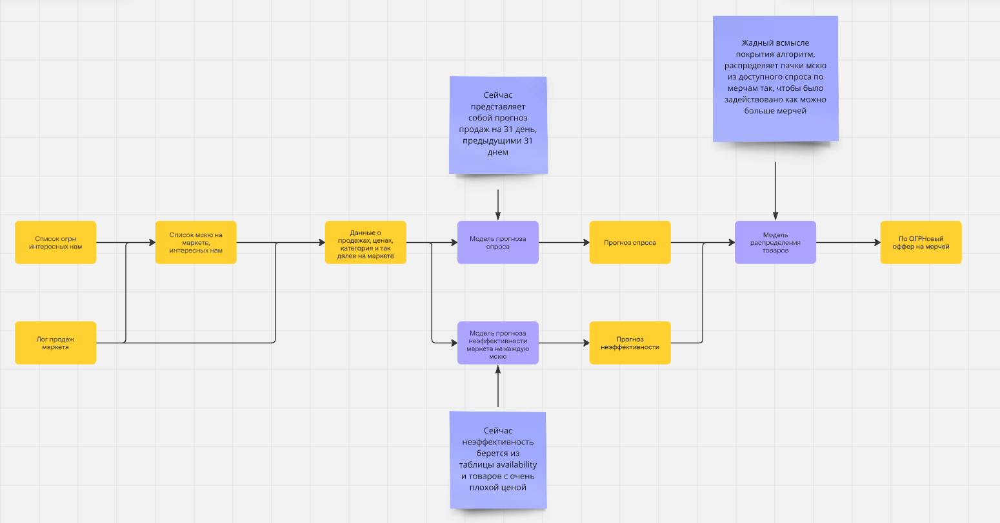
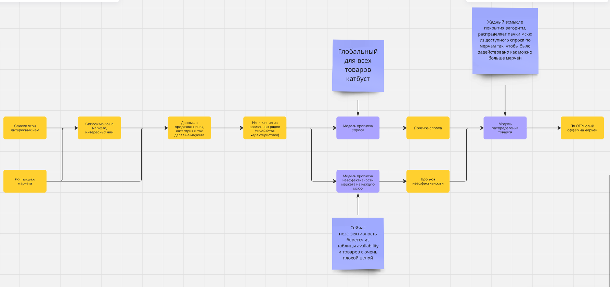

# 3p/1p биржа

Прогноз спроса на товары в известном всем Я.Маркете

## Цели и предпосылки

Зачем нужен прогноз спроса?
Глобально целей преследуется много:
В рамках 3p биржи хотим растить оборот продукта не тратя много своих денег, или не тратя их вовсе.
Также хотим привлекать новых продавцов на маркет с соседних маркетплейсов или раскручивать текущих.
В рамках 1p биржи хотим оптимизировать распределения товаров по складам чтобы меньше терять на грузоперевозках и хранении.

И так

AS IS: Привлечение мерчей делается почти полностью руками из кучи эвристик, а распределение по складам слишком краткосрочное
TO BE: Автоматическое формирование выгодных оферов внутренним и внешним мерчам, планирование складов на > 31 день.

Далее сконцентрируемся на 3p бирже для единства цели.

Юзкейс в рамках 3p
Хотим преложить мерчам следующее:
Закупите и привезите нам 100 усл.ед. товара по цене в 1000 усл.ед и мы гарантируем их продажу за 45 дней по цене 1100 усл.ед. , иначе по установленной цене 1100 усл.ед. маркет выкупит их сам.

Мы знаем экономическую недоступность товара (не было на складе а клики и спрос был) а также его эластичность по цене и внутрянку ранжирования товаров, если будем знать сколько товара продастся за следующие (горизонт) дней то сможем выдвинуть мерчам оффер выше.

Очевидно если прогноз достаточно хорош мы ничего не теряем и растим оборотку из воздуха за счет смелости мерчей.
Столь же очевидно что мерчам это выгодно так как они ничего не теряют.
Это можно предлагать как внутри маркета мелким мерчам так и приманивать на маркет внешних.

## Глобальная метрика успеха

Успехом считаем размен роста оборота к затратам в юнит экономике (dGMV/dUE, далее лямда, lambda, размен и иже с ними) >= 6.5
Невероятным успехом считаем отрицательный размен (Рост оборота и уменьшение затрат на юнитку)

## Бизнес требования

На первой итерации бюджет ограничен слабо, но в тестовых моделях ожидаемая доля выкупа товара должна быть < 30%.
Нельзя предлагать:
Крупногабаритные товары (тяжело распределять)
Маркированные товары (честный знак и т.п.)
Товары 18+
Сверхпопулярные товары (Iphone, dyson, samsung ...)
Продажи на следующие (горизонт) дней должно быть можно получить каждый день.

## Цели итерации

Сформировать спискок товаров на который будет даваться прогноз
Получить прогноз на 31 день
Получить список оферов (товар + продавец + количество)
Сделать офера мерчам и сравнить с тем что сейчас делается руками
Если lambda_нашего лучше lambda_ручного фиксируем автоматизируем выгрузки.

На следующие итерации оставляем ablation study, введение нескольких горизонтов и автоматические поправки в динамической таблице

## Предпосылки решения

Фичами можно сделать все что найдем на кластере маркета, из очевидного что достать легко:
История продаж товара на каждый день
История цены товара на каждый день на маркете и у конкурентов (в том числе их распределения)
Категориальные переменные категории товаров (Электроника, автомобильные товары, медицина и т.п. в том числе вложенные Электроника/смартфоны/...)
Факторы ранжирования (как часто товар попадает в топ 6/10/36 на выдаче по запросам или средняя позиция в выдачке, при условии что товар в нее попал)
Горизонт прогноза на первом этапе 31 день, для выкупа 45 дней чтобы был запас в 2 недели на продажу товара
Гранулярность подневная

## Постановка задачи
Построить модель прогноза спроса фиксированных товаров на 31 день по историческим данным.
Для этого:
Провести EDA, определить товары на которые прогноз делать имеет смысл (если товар продается на 1000 рублей в месяц а ошибка на нем 80% будет очень грустно)
Провести выбор модели (ага, только у нас можно только катбуст) и оптимизацию гиперпараметров.
Имея прогноз спроса оценить максимальный офер который мы можем сделать в отсутствии всякой информации о предыдущих экспериментах, например офер = (прогноз * (экономическая недоступность + доля оферов с значительно более плохой ценой в прошлый месяц))

## Решение

Метрики:
MAPE - лосс
WAPE - техническая (взвешенная на количество продаж)
bias - техническая
Доля выкупа - бизнесовая

Очевидным бейзлайном как всегда является:
В следующий месяц продажи будут как в этом.

Так как нам нужен прогноз на месяц вперед, а месяцев в году мало, а еще хочется иметь прогноз на месяц каждый день и еще хочется втащить категории, в качестве модели был выбран катбуст. Обычные в этих ситуациях модели (EMA и Prophet) были использованны для извлечения фичей и позже вовсе отброшены (хуже чем статпризнаки)
Чтобы получить глобальную модель таргет преобразовывался (продажи за будущий месяц)/(продажи за прошлый месяц)
Применялся time series split потому что нужно боротся с переобучением.
Временная переменная была исключена из прогноза для избежания все того же оверфита

# Флоучарты

Бейзлайн

Прод

