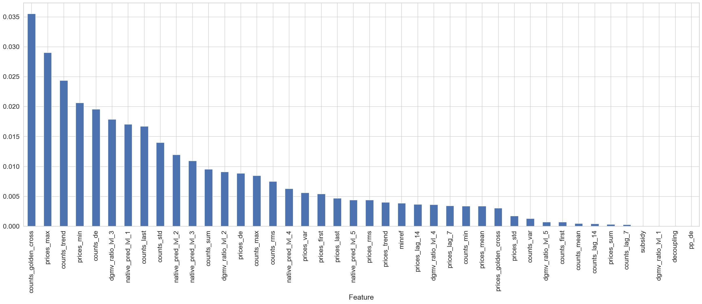

# 3p/1p биржа

Прогноз спроса на товары в известном всем Я.Маркете

## Цели и предпосылки


Зачем нужен прогноз спроса?
Глобально целей преследуется много:
В рамках 3p биржи хотим растить оборот продукта не тратя много своих денег, или не тратя их вовсе.
Также хотим привлекать новых продавцов на маркет с соседних маркетплейсов или раскручивать текущих.
В рамках 1p биржи хотим оптимизировать распределения товаров по складам чтобы меньше терять на грузоперевозках и хранении.

И так

AS IS: Привлечение мерчей делается почти полностью руками из кучи эвристик, а распределение по складам слишком краткосрочное
TO BE: Автоматическое формирование выгодных оферов внутренним и внешним мерчам, планирование складов на > 31 день.

Далее сконцентрируемся на 3p бирже для единства цели.

Юзкейс в рамках 3p
Хотим преложить мерчам следующее:
Закупите и привезите нам 100 усл.ед. товара по цене в 1000 усл.ед и мы гарантируем их продажу за 45 дней по цене 1100 усл.ед. , иначе по установленной цене 1100 усл.ед. маркет выкупит их сам.

Мы знаем экономическую недоступность товара (не было на складе а клики и спрос был) а также его эластичность по цене и внутрянку ранжирования товаров, если будем знать сколько товара продастся за следующие (горизонт) дней то сможем выдвинуть мерчам оффер выше.

Очевидно если прогноз достаточно хорош мы ничего не теряем и растим оборотку из воздуха за счет смелости мерчей.
Столь же очевидно что мерчам это выгодно так как они ничего не теряют.
Это можно предлагать как внутри маркета мелким мерчам так и приманивать на маркет внешних.

## Глобальная метрика успеха

Успехом считаем размен роста оборота к затратам в юнит экономике (dGMV/dUE, далее лямда, lambda, размен и иже с ними) >= 6.5
Невероятным успехом считаем отрицательный размен (Рост оборота и уменьшение затрат на юнитку)

## Бизнес требования

На первой итерации бюджет ограничен слабо, но в тестовых моделях ожидаемая доля выкупа товара должна быть < 30%.
Нельзя предлагать:
Крупногабаритные товары (тяжело распределять)
Маркированные товары (честный знак и т.п.)
Товары 18+
Сверхпопулярные товары (Iphone, dyson, samsung ...)
Продажи на следующие (горизонт) дней должно быть можно получить каждый день.

## Цели итерации

Сформировать спискок товаров на который будет даваться прогноз
Получить прогноз на 31 день
Получить список оферов (товар + продавец + количество)
Сделать офера мерчам и сравнить с тем что сейчас делается руками
Если lambda_нашего лучше lambda_ручного фиксируем автоматизируем выгрузки.

На следующие итерации оставляем ablation study, введение нескольких горизонтов и автоматические поправки в динамической таблице

## Предпосылки решения

Фичами можно сделать все что найдем на кластере маркета, из очевидного что достать легко:
История продаж товара на каждый день
История цены товара на каждый день на маркете и у конкурентов (в том числе их распределения)
Категориальные переменные категории товаров (Электроника, автомобильные товары, медицина и т.п. в том числе вложенные Электроника/смартфоны/...)
Факторы ранжирования (как часто товар попадает в топ 6/10/36 на выдаче по запросам или средняя позиция в выдачке, при условии что товар в нее попал)
Горизонт прогноза на первом этапе 31 день, для выкупа 45 дней чтобы был запас в 2 недели на продажу товара
Гранулярность подневная

## Постановка задачи
Построить модель прогноза спроса фиксированных товаров на 31 день по историческим данным.
Для этого:
Провести EDA, определить товары на которые прогноз делать имеет смысл (если товар продается на 1000 рублей в месяц а ошибка на нем 80% будет очень грустно)
Провести выбор модели (ага, только у нас можно только катбуст) и оптимизацию гиперпараметров.
Имея прогноз спроса оценить максимальный офер который мы можем сделать в отсутствии всякой информации о предыдущих экспериментах, например офер = (прогноз * (экономическая недоступность + доля оферов с значительно более плохой ценой в прошлый месяц))

## Решение

Метрики:
MAPE - лосс
WAPE - техническая (взвешенная на количество продаж)
bias - техническая
Доля выкупа - бизнесовая

Очевидным бейзлайном как всегда является:
В следующий месяц продажи будут как в этом.

Так как нам нужен прогноз на месяц вперед, а месяцев в году мало, а еще хочется иметь прогноз на месяц каждый день и еще хочется втащить категории, в качестве модели был выбран катбуст. Обычные в этих ситуациях модели (EMA и Prophet) были использованны для извлечения фичей и позже вовсе отброшены (хуже чем статпризнаки)
Чтобы получить глобальную модель таргет преобразовывался (продажи за будущий месяц)/(продажи за прошлый месяц)
Применялся time series split потому что нужно боротся с переобучением.
Временная переменная была исключена из прогноза для избежания все того же оверфита

# Флоучарты

Бейзлайн


Прод


# EDA

[Смотри блокнотик](../notebooks/LAMA_attempt_V1.ipynb)

## Подготовка данных


В качестве датасета, как сказанно выше, можно использовать все что найдется на рабочем кластере.
В основном нас интересуют заказы определенного товара каждый день и статические описания товаров,
а также позиция в ранжировании и промо давление на товар (количество скидок которые на него выписывают).
С вышеупомянутыми фичами нашлись следующие осложняющие обстоятельства:
- Лог позиции ранжирования опаздывает от заказов на один день (решили поджойнить со смещением)
- Промо не известно на будущее для товаров, которые не продаются на прямую я.маркетом (взяли среднюю скидку за день для товара)

Данные в лог заказов поступают каждые четыре часа из аналогичной динамической таблицы на продовом кластере (почти как redis только свой)
в формате побитой на товары корзины (id товара, продавец, количество, время заказа, ...) всего колонок 159 но там ничего интересного

Лог ранжирования варится постфактум за предыдущий день по средним позициям в ранжировании товаров на проде (фичами может быть например - показывается 
ли товар в топе выдачи, его MRR@<размер выдачи> и т.п.)

Из описания товаров нам нужны только категории, их часто меняют но в случае если категорию уровня 5 не нашли мы переходим на уровень 4 и так далее,
категории уровня 1 очень стабильны

Данных более чем достаточно, их даже слишком много, эксперименты показали что модели на данных за 15 месяцев хуже чем модели за 4 месяца,
в связи с чем мы запрунили датасет (а именно убрали товары, которых продается менее 5 штук в месяц из тренировочной выборки)
и взвесили наблюдения в тренировочной выборке линейно по времени (чем ближе к текущей дате тем выше).

Основная цель этапа - собрать MVP на легкодоступных данных, если метрики покажут жизнеспособность прогноза то можно будет идти к команде промо
договариватся о поставках информации о будущих промо например.

## Подготовка прогнозных моделей

### Описание метрик

Так как товары разной ликвидности и объема продаж, нужна относительная функция потерь, например MAPE
лосс функцию оптимизирующую MAPE можно сделать взвесив всем известный MAE. Помимо нее как метрики будем мониторить 
WAPE, bias, Доля выкупа (в нашей терминологии inacuracy)

```math
MAPE = \sum{\frac{|\hat{y} - y|}{y}}
```

```math
WAPE = \frac{\sum{|\hat{y} - y|}}{\sum{y}}
```

```math
bias = \sum{\frac{\hat{y} - y}{y}}
```

```math
inacuracy = \sum{\frac{relu(\hat{y} - y)}{\hat{y}}}
```

Обращаю внимание читателя на намеренное опускание модуля в знаменателе - продажи положительные

Предвосхищая вопрос о странности метрики inacuracy - представлять ее стоит как среднюю долю выкупленных маркетом товаров.

Среди статистических фичей, собранных из лога заказов имеется среднедневные продажи за предыдущий горизонт, предлагается следующее преобразование таргета:

```math
\tilde{y_{curr}} = \frac{y_{curr}}{mean(y_{prev}) * horizon}
```


Теперь мы от метрики MAPE переходи к более приятной MAE не думая о сложностях оптимизации и нестабильности первой.

### Валидация

Забиваем на time series split и руками отделяем dev set для валидации, так намного надежнее.
Валидационная выборка естественно находится в будущем для каждого из товаров, теперь можно учить модельки как на обычных табличных данных (при таком подходе хорошо бы мониторить метрики в реальном времени, под это дело у нас есть мониторинги)
Бейслайн - прогноз предыдущим месяцем

| Metric      | Model | Baseline |
|-------------|-------|----------|
| MAPE        |   0.38   |     0.48     |
| WAPE        |   0.32    |    0.43      |
| Bias        |   -0.06    |     -0.09     |
| Inaccuracy  |    0.15   |     0.22     |

Итак baseline побежден (а это всегда не просто) и можно катится в прод

### Дальнейшее развитие

Нужно доказать экономическую эффективность прогноза, сейчас мы в процессе анализа отзывов от мерчей о нашей стратегии, из 2000 рекомендаций заинтересовались лишь сотней товаров, заказали на наших условиях 70 а распродали 50, бутылочным горлышком является незнание мерчей о наших акциях или недостаточная вовлеченность - это и предстоит выяснить.

Текущий размен (смотри определение выше) 22.11 что очень хорошо. Хотим договорится с командой промо акций выгружать нам данные зарание и ускорить доезд ранжирования. Также нужно внести улучшенную поддержку фичей праздников и high(low)season

### Интерпретация работы модели

Из метрик виден недопрогноз, но это на доноябрьских данных, на момент 2024-12-29 наблюдается перепрогноз аналогичной амплитуды (связанно с выходом из высокого сезона, на удивление покупают больше на 11.11 чем на новый год) следовательно смещение гуляет возле нуля, чего мы и добивались.

Feature importance:



Неполное описание
counts - число товаров
prices - цены товаров
после подчеркивания идет название статистической характеристики
они self-explanatory за исключением быть может:

golden_cross - [золотые пересечения](https://www.investopedia.com/terms/g/goldencross.asp) из технического анализа

de - [энергия Дирихле](https://en.wikipedia.org/wiki/Dirichlet_energy)

а также прочие фичи:

decoupling и subsidy виды промо

minref - минимальная цена у конкурентов

pp_de - энергия Дирихле эластичности товар по цене

dgmv_ratio_lvl_X - отношение суммы продаж в категории в следующем месяце к этому в прошлом году (примерно как наш новый таргет но не для товара а для категории и со смещением в 365 дней назад)
native_pred_lvl_X - dgmv_ratio_lvl_X * counts_mean * horizon

### Риски и результат

Есть вероятность что мерчи закажут товар и расслабятся (не будут обновлять описание, фото, карточку и т.п.) так как мы у них все равно по договорной цене выкупим товар - нужно прописать в договоре что их активность обязательна, у нас есть автогенерация карточек и автоперенос карточек с других маркетплейсов с позволения мерча. Необходимый результат был указан выше - размен > 6.5, сейчас нужно растить покрытие чтобы вовлекать больше продавцов.

